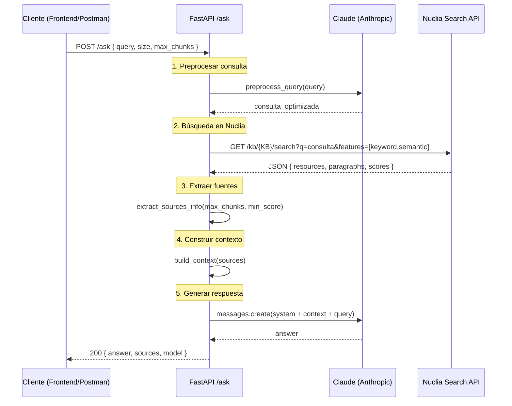
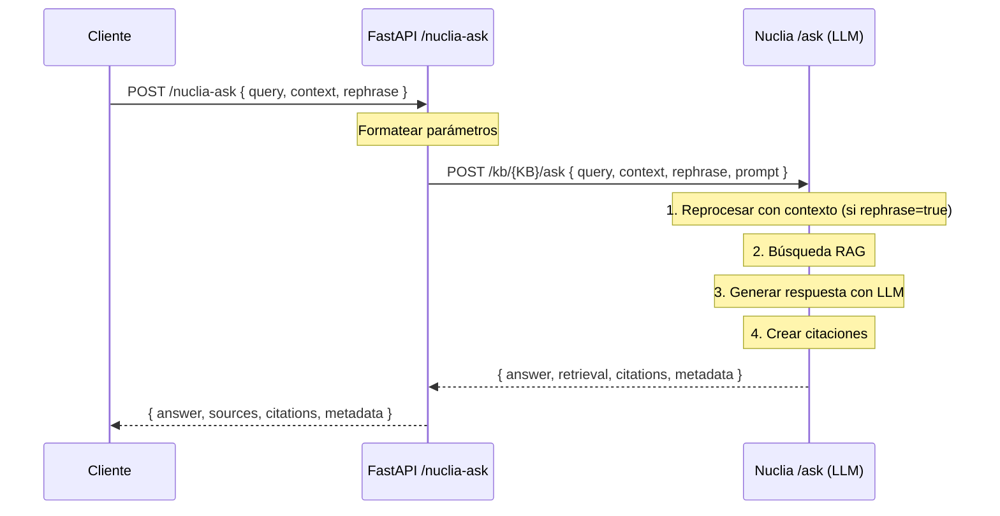

# UVG-Agent 🎓

Un agente inteligente backend basado en FastAPI que integra el LLM de Anthropic (Claude Sonnet 4) y Nuclia para gestión y recuperación de conocimiento mediante RAG. Este proyecto proporciona una API simple y extensible para interactuar con modelos de lenguaje grandes y bases de conocimiento, con un frontend moderno que muestra resultados de búsqueda con visualización de fuentes similares a Nuclia.

## ✨ Características Principales
- 🚀 **API REST** construida con FastAPI
- 🤖 **Integración con Claude Sonnet 4** (Anthropic) - Modelo más avanzado
- 📚 **Cliente Nuclia** para búsqueda RAG (keyword + semántica)semántica
- 🎯 **Código modular** y extensible


## 📋 Requisitos
- Python 3.10+
- Ver `requirements.txt` para las dependencias de Python

## 🚀 Instalación Rápida
1. **Clonar el repositorio:**
   ```bash
   git clone <repo-url>
   cd UVG-Agent-sonnet
   ```
2. **Crear un entorno virtual (recomendado):**
   ```bash
   python3 -m venv .venv
   source .venv/bin/activate
   ```
3. **Instalar dependencias:**
   ```bash
   pip install -r requirements.txt
   ```
4. **Configurar variables de entorno:**
   ```bash
   cp .env.example .env
   ```
   Luego edita el archivo `.env` y configura:
   - `NUCLIA_API_BASE`: URL base de la API de Nuclia
   - `KB`: ID de tu Knowledge Base en Nuclia
   - `NUCLIA_TOKEN`: Tu token de autenticación de Nuclia
   - `ANTHROPIC_KEY`: Tu API key de Anthropic
   - `CLAUDE_MODEL`: Modelo de Claude a usar (por defecto: claude-sonnet-4-20250514)
   - `INSTRUCTIONS`: Instrucciones del sistema para el agente (opcional)

## 🎯 Uso

### Opción 1: Script de Inicio Rápido (Recomendado) ⭐
```bash
# Dale permisos (solo la primera vez)
chmod +x start-enhanced.sh

# Ejecuta el script
./start-enhanced.sh
```

Luego abre el frontend:
```bash
open frontend/uvg-agent-enhanced.html
```

### Opción 2: Inicio Manual

**1. Iniciar Backend:**
```bash
source .venv/bin/activate
uvicorn app.main:app --reload
```


### Acceso a la API:
- **API Backend**: `http://localhost:8000`
- **Documentación Interactiva (Swagger)**: `http://localhost:8000/docs`
- **Documentación Alternativa (ReDoc)**: `http://localhost:8000/redoc`

## Endpoints de la API

### 1. Verificación de Salud
**GET** `/health`

Verifica si la API está funcionando.

**Ejemplo de Solicitud:**
```bash
curl http://localhost:8000/health
```

**Respuesta:**
```json
{
  "status": "ok"
}
```

---

### 2. Ask Agent (RAG Personalizado)
**POST** `/ask`

Realiza una pregunta usando un pipeline RAG personalizado: preprocesa la consulta con LLM, busca en Nuclia, construye contexto y genera una respuesta con Claude.

**Cuerpo de la Solicitud:**
```json
{
  "query": "¿Cómo puedo inscribirme en un curso?",
  "size": 30,
  "max_chunks": 10,
  "use_semantic": true,
  "min_score": 0.5
}
```

**Parámetros:**
- `query` (string, **requerido**): La pregunta a realizar (2-2000 caracteres)
- `size` (integer, opcional): Número de resultados de búsqueda a recuperar de Nuclia (1-100, por defecto: 30)
- `max_chunks` (integer, opcional): Número máximo de párrafos a incluir en el contexto (1-50, por defecto: 20)
- `use_semantic` (boolean, opcional): Activar búsqueda semántica además de keyword (por defecto: true)
- `min_score` (float, opcional): Score mínimo de relevancia (0.0-1.0, por defecto: 0.0)

**Ejemplo de Solicitud en Postman:**

1. **Método**: `POST`
2. **URL**: `http://localhost:8000/ask`
3. **Headers**:
   - `Content-Type: application/json`
4. **Body** (raw JSON):
```json
{
  "query": "¿Cómo puedo inscribirme en un curso?",
  "size": 30,
  "max_chunks": 10,
  "use_semantic": true,
  "min_score": 0.5
}
```

**Ejemplo con cURL:**
```bash
curl -X POST http://localhost:8000/ask \
  -H "Content-Type: application/json" \
  -d '{
    "query": "¿Cómo puedo inscribirme en un curso?",
    "size": 30,
    "max_chunks": 10,
    "use_semantic": true,
    "min_score": 0.5
  }'
```

**Respuesta Exitosa:**
```json
{
  "answer": "Para inscribirte en un curso en la UVG...",
  "sources": [
    {
      "id": "doc123/chunk1",
      "title": "Guía de Inscripción UVG",
      "text": "El proceso de inscripción...",
      "score": 0.89,
      "page": 5,
      "url": "https://...",
      "url_type": "external",
      "has_url": true
    }
  ],
  "model": "claude-sonnet-4-20250514"
}
```

**Diagrama de Flujo del Pipeline RAG:**



---

### 3. Nuclia Ask (LLM Generativo de Nuclia)
**POST** `/nuclia-ask`

Usa directamente el endpoint `/ask` de Nuclia con su LLM generativo integrado. Soporta conversaciones tipo chatbot con contexto, prompts personalizados, y citaciones.

**Cuerpo de la Solicitud:**
```json
{
  "query": "¿Cuáles son los requisitos de admisión?",
  "context": [
    {
      "author": "USER",
      "text": "¿Qué programas ofrece la UVG?"
    },
    {
      "author": "NUCLIA",
      "text": "La UVG ofrece programas de pregrado, postgrado y educación continua..."
    }
  ],
  "rephrase": true,
  "citations": "llm_footnotes",
  "synchronous": true,
  "features": ["keyword", "semantic"],
  "max_tokens": 500
}
```

**Parámetros:**
- `query` (string, **requerido**): Pregunta del usuario (2-2000 caracteres)
- `context` (array, opcional): Historial conversacional para chatbot. Cada elemento debe tener:
  - `author`: "USER" o "NUCLIA"
  - `text`: Contenido del mensaje
- `rephrase` (boolean, opcional): Si reprocesar la pregunta usando el contexto para mejorar búsqueda (por defecto: false)
- `citations` (string, opcional): Formato de citaciones ('default', 'llm_footnotes', o null)
- `filters` (array, opcional): Filtros de búsqueda (ej: `["/classification.labels/tipo/documento"]`)
- `prompt` (object, opcional): Prompts personalizados con:
  - `system`: Comportamiento del modelo
  - `user`: Template con {context} y {question}
  - `rephrase`: Optimización de búsqueda
- `synchronous` (boolean, opcional): True para respuesta completa, False para streaming (por defecto: true)
- `features` (array, opcional): Features de búsqueda ['keyword', 'semantic', 'relations']
- `max_tokens` (integer, opcional): Número máximo de tokens en la respuesta (1-4096)

**Ejemplo Simple:**
```json
{
  "query": "¿Cómo puedo inscribirme en un curso?",
  "citations": "llm_footnotes",
  "features": ["keyword", "semantic"]
}
```

**Ejemplo de Chatbot (con contexto):**
```json
{
  "query": "¿Y cuál es el proceso?",
  "context": [
    {
      "author": "USER",
      "text": "¿Cómo puedo cambiar de carrera en la UVG?"
    },
    {
      "author": "NUCLIA",
      "text": "Para cambiar de carrera debes contactar a tu asesor académico..."
    }
  ],
  "rephrase": true,
  "citations": "llm_footnotes"
}
```

**Ejemplo con Prompts Personalizados:**
```json
{
  "query": "¿Qué becas hay disponibles?",
  "prompt": {
    "system": "Eres un experto en becas universitarias. Usa lenguaje formal y preciso.",
    "user": "Basándote en este contexto: {context}\n\nResponde esta pregunta: {question}\n\nSé específico con fechas y requisitos.",
    "rephrase": "Enfócate en becas y ayuda financiera disponibles en Guatemala"
  },
  "features": ["keyword", "semantic"],
  "max_tokens": 800
}
```

**Ejemplo con cURL:**
```bash
curl -X POST http://localhost:8000/nuclia-ask \
  -H "Content-Type: application/json" \
  -d '{
    "query": "¿Qué programas de ingeniería ofrece la UVG?",
    "citations": "llm_footnotes",
    "features": ["keyword", "semantic"],
    "max_tokens": 500
  }'
```

**Respuesta Exitosa:**
```json
{
  "answer": "La UVG ofrece los siguientes programas de ingeniería[^1]:\n\n- Ingeniería en Ciencias de la Computación\n- Ingeniería Industrial[^2]\n- Ingeniería Civil\n\n[^1]: block-AA\n[^2]: block-CB",
  "sources": [
    {
      "id": 1,
      "text": "La Universidad del Valle de Guatemala cuenta con...",
      "score": 0.92,
      "resource_id": "abc123",
      "field": "/a/file/page/0",
      "title": "Catálogo de Programas 2025"
    }
  ],
  "metadata": {
    "tokens": {
      "input": 1250,
      "output": 180
    },
    "timings": {
      "total": 2.5
    }
  },
  "citations": {
    "block-AA": "paragraph_id_1",
    "block-CB": "paragraph_id_5"
  },
  "relations": [],
  "nuclia_kb": "your-kb-id",
  "params": {
    "rephrase": false,
    "citations": "llm_footnotes",
    "synchronous": true,
    "features": ["keyword", "semantic"]
  }
}
```

**Diferencias con `/ask`:**

| Característica | `/ask` (Pipeline Personalizado) | `/nuclia-ask` (Nuclia LLM) |
|----------------|--------------------------------|----------------------------|
| **LLM** | Claude Sonnet 4 (Anthropic) | LLM de Nuclia/OpenAI |
| **Control** | Total sobre pipeline RAG | Delegado a Nuclia |
| **Contexto conversacional** | No soportado | ✅ Soportado nativamente |
| **Citaciones** | Básicas (fuentes) | ✅ Footnotes con referencias |
| **Prompts personalizados** | Fijos en código | ✅ Dinámicos por request |
| **Reprocesamiento** | Manual con LLM | ✅ Automático si `rephrase=true` |
| **Costo** | Tokens de Claude | Tokens de Nuclia |

**Diagrama de Flujo:**



---

## Estructura del Proyecto

### Archivos Principales del Backend

- **`app/main.py`** - Punto de entrada de la aplicación FastAPI. Define los endpoints HTTP (`/health`, `/ask`, `/nuclia-ask`) y configura el middleware CORS.

- **`app/agent.py`** - Lógica de orquestación del agente RAG personalizado. Implementa el pipeline completo para `/ask`: preprocesamiento de consultas, búsqueda en Nuclia, extracción de fuentes con URLs y metadata, construcción de contexto, y generación de respuestas con Claude.

- **`app/llm.py`** - Módulo de integración con LLM. Contiene la función `preprocess_query()` que usa Claude para optimizar las preguntas de usuario en mejores consultas de búsqueda.

- **`app/nuclia.py`** - Cliente de la API de Nuclia. Proporciona funciones para:
  - `nuclia_search()`: Búsqueda híbrida (keyword + semantic) con filtros y parámetros avanzados
  - `nuclia_ask()`: Llamada al endpoint `/ask` de Nuclia con soporte para chatbot y LLM generativo
  - `build_context()`: Construcción de contexto con metadata completa
  - `parse_nuclia_ask_response()`: Parseo de respuestas del LLM de Nuclia

- **`app/clients.py`** - Inicialización de clientes API. Crea la instancia del cliente Anthropic usado en toda la aplicación.

- **`app/schemas.py`** - Modelos Pydantic para validación de solicitudes/respuestas:
  - `AskBody`: Esquema para `/ask` (pipeline personalizado)
  - `NucliaAskBody`: Esquema para `/nuclia-ask` (LLM de Nuclia)
  - `ConversationContext`: Modelo para mensajes del chatbot
  - `CustomPrompt`: Modelo para prompts personalizados

- **`app/settings.py`** - Cargador de configuración y variables de entorno. Usa `python-dotenv` para cargar claves API, nombres de modelos e instrucciones del sistema desde el archivo `.env`.

- **`app/config.py`** - Exportaciones de configuración. Re-exporta configuraciones como constantes a nivel de módulo para importación fácil.

### Configuración

- **`.env.example`** - Plantilla de variables de entorno.
- **`.gitignore`** - Archivos y directorios excluidos del control de versiones.
- **`requirements.txt`** - Dependencias Python del proyecto.
- **`start-enhanced.sh`** - Script de inicio rápido del servidor.

---

